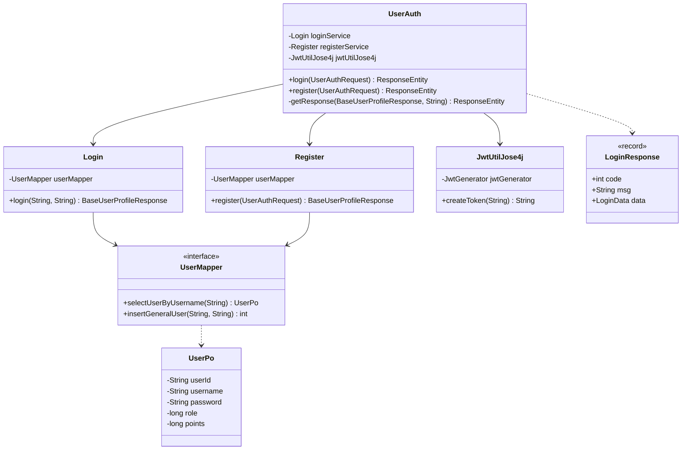
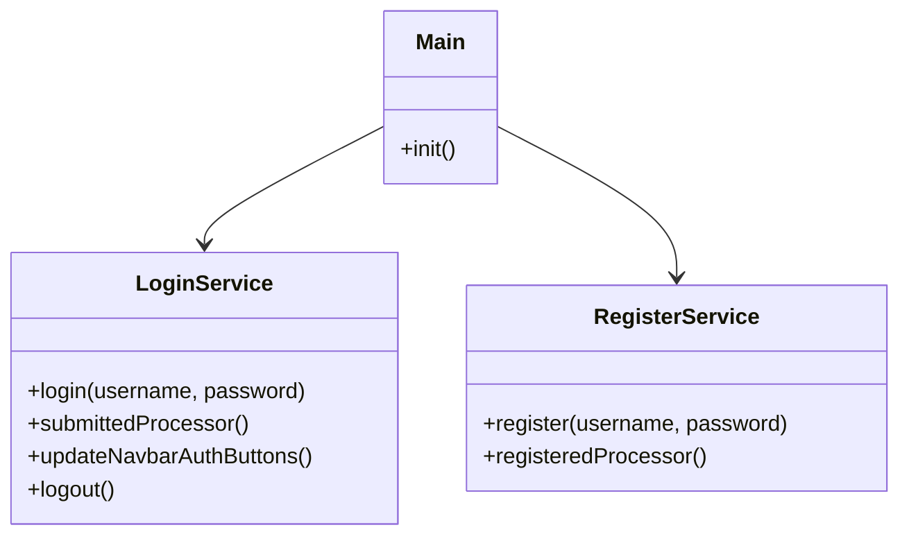
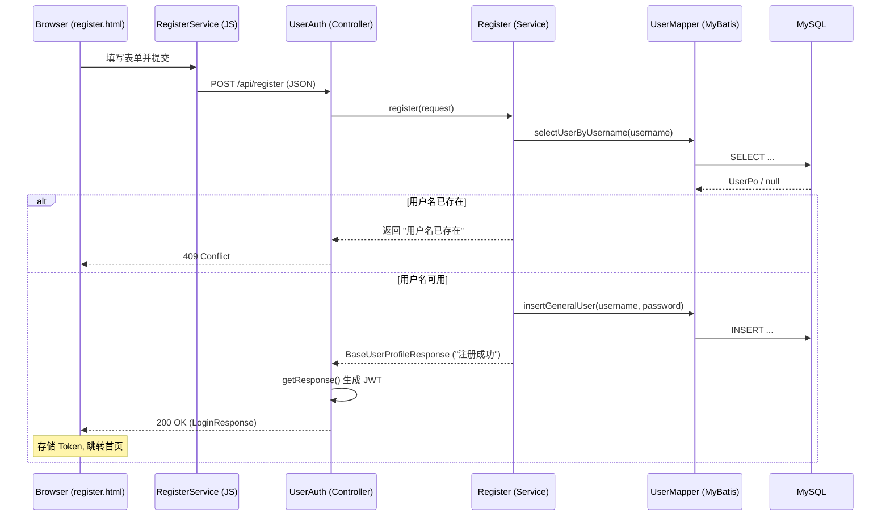
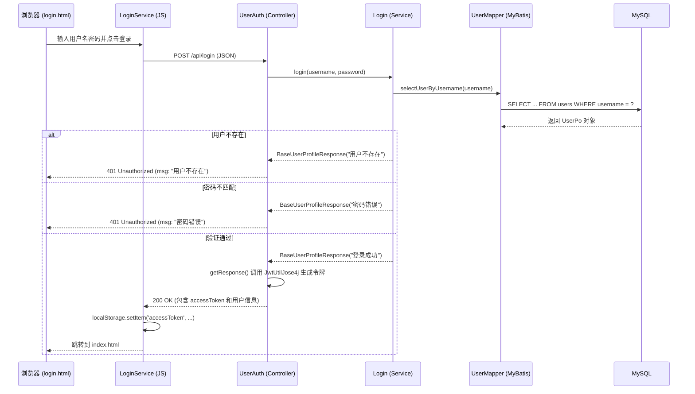

本文档描述了认证模块相关的各个UML文档。我将依次编写出对应的工程图。

# UML 类图
## 后端架构类图

```mermaid
classDiagram
    class UserAuth {
        -Login loginService
        -Register registerService
        -JwtUtilJose4j jwtUtilJose4j
        +login(UserAuthRequest) ResponseEntity
        +register(UserAuthRequest) ResponseEntity
        -getResponse(BaseUserProfileResponse, String) ResponseEntity
    }

    class Login {
        -UserMapper userMapper
        +login(String, String) BaseUserProfileResponse
    }

    class Register {
        -UserMapper userMapper
        +register(UserAuthRequest) BaseUserProfileResponse
    }

    class UserMapper{ <<interface>> 
        +selectUserByUsername(String) UserPo
        +insertGeneralUser(String, String) int
    }

    class UserPo {
        -String userId
        -String username
        -String password
        -long role
        -long points
    }

    class JwtUtilJose4j {
        -JwtGenerator jwtGenerator
        +createToken(String) String
    }

    class LoginResponse{ <<record>> 
        +int code
        +String msg
        +LoginData data
    }

    UserAuth --> Login
    UserAuth --> Register
    UserAuth --> JwtUtilJose4j
    Login --> UserMapper
    Register --> UserMapper
    UserMapper ..> UserPo
    UserAuth ..> LoginResponse
```

## 前端架构类图

```mermaid
classDiagram
    class Main {
        +init()
    }
    class LoginService {
        +login(username, password)
        +submittedProcessor()
        +updateNavbarAuthButtons()
        +logout()
    }
    class RegisterService {
        +register(username, password)
        +registeredProcessor()
    }

    Main --> LoginService
    Main --> RegisterService
```

# 时序图
## 注册流程

```mermaid
sequenceDiagram
    participant B as Browser (register.html)
    participant FS as RegisterService (JS)
    participant C as UserAuth (Controller)
    participant S as Register (Service)
    participant M as UserMapper (MyBatis)
    participant DB as MySQL

    B->>FS: 填写表单并提交
    FS->>C: POST /api/register (JSON)
    C->>S: register(request)
    S->>M: selectUserByUsername(username)
    M->>DB: SELECT ...
    DB-->>M: UserPo / null
    
    alt 用户名已存在
        S-->>C: 返回 "用户名已存在"
        C-->>B: 409 Conflict
    else 用户名可用
        S->>M: insertGeneralUser(username, password)
        M->>DB: INSERT ...
        S-->>C: BaseUserProfileResponse ("注册成功")
        C->>C: getResponse() 生成 JWT
        C-->>B: 200 OK (LoginResponse)
        Note over B: 存储 Token, 跳转首页
    end
```

## 登录流程

```mermaid
sequenceDiagram
    participant B as 浏览器 (login.html)
    participant LS as LoginService (JS)
    participant C as UserAuth (Controller)
    participant S as Login (Service)
    participant M as UserMapper (MyBatis)
    participant DB as MySQL

    B->>LS: 输入用户名密码并点击登录
    LS->>C: POST /api/login (JSON)
    C->>S: login(username, password)
    S->>M: selectUserByUsername(username)
    M->>DB: SELECT ... FROM users WHERE username = ?
    DB-->>M: 返回 UserPo 对象
    
    alt 用户不存在
        S-->>C: BaseUserProfileResponse("用户不存在")
        C-->>B: 401 Unauthorized (msg: "用户不存在")
    else 密码不匹配
        S-->>C: BaseUserProfileResponse("密码错误")
        C-->>B: 401 Unauthorized (msg: "密码错误")
    else 验证通过
        S-->>C: BaseUserProfileResponse("登录成功")
        C->>C: getResponse() 调用 JwtUtilJose4j 生成令牌
        C-->>LS: 200 OK (包含 accessToken 和用户信息)
        LS->>LS: localStorage.setItem('accessToken', ...)
        LS-->>B: 跳转到 index.html
    end
```